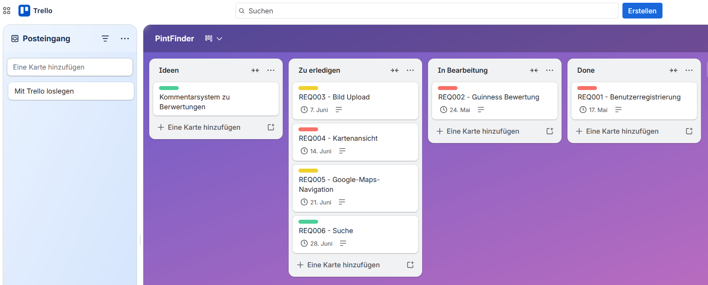
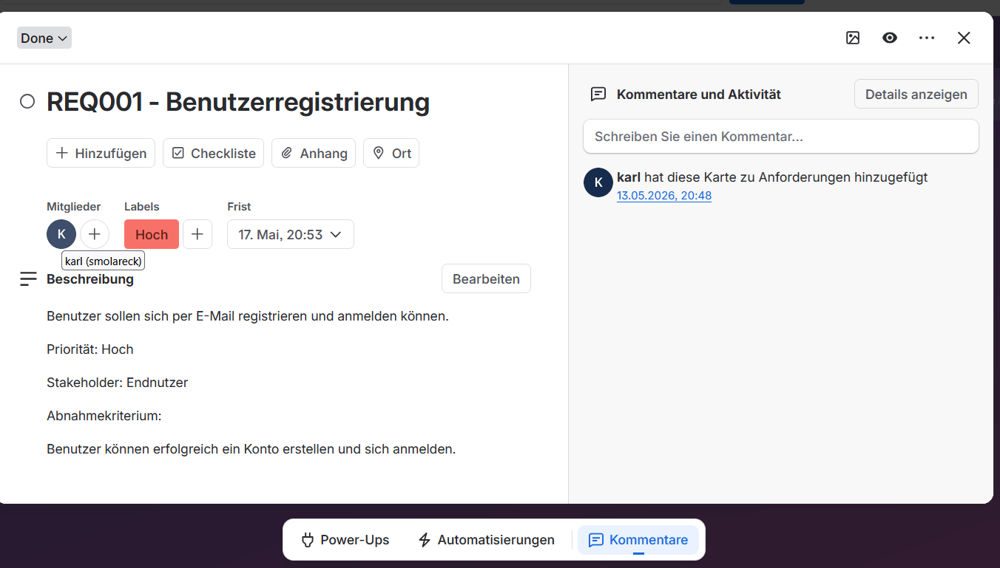
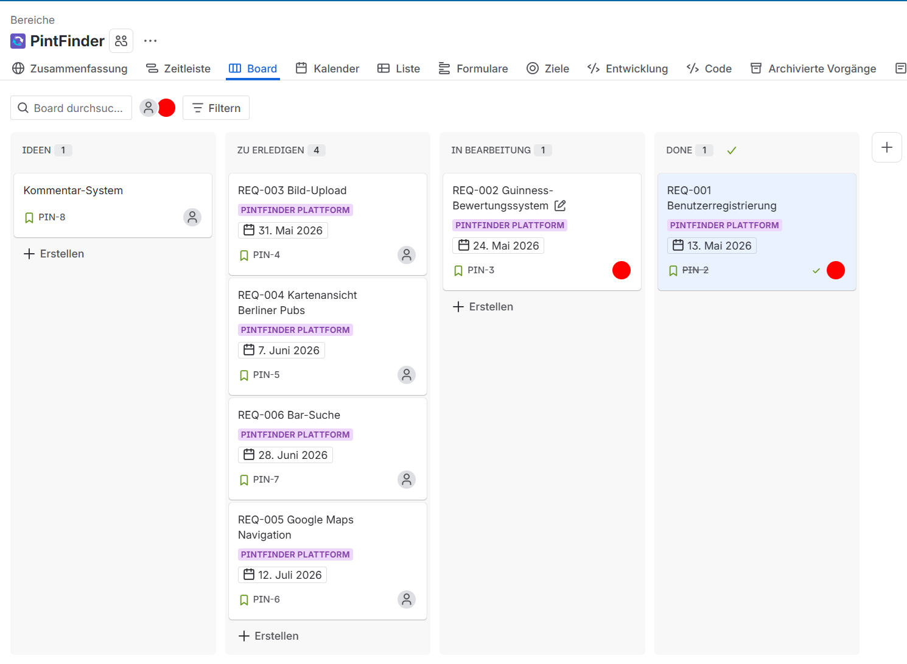
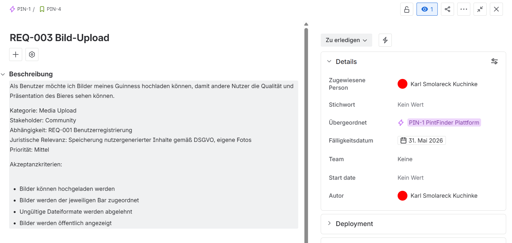

# Einsendeaufgabe REQ-E1
## PintFinder-Requirements Projekt

# Projektbeschreibung
PintFinder ist eine App zur Bewertung von Guinness-Bieren in Berliner Bars, Pubs und Kneipen. Benutzer können Bars finden, Guinness bewerten, Bilder hochladen und über eine Kartenansicht direkt zu einer Bar navigieren.

---

# Verwendete Werkzeuge

## Self-Made Tool
- Trello

## Kommerzielles Tool
- Jira

---

# Anforderungen (Requirements)

Folgende Requirements wurden erstellt und dokumentiert:

- REQ-001 Benutzerregistrierung
- REQ-002 Guinness-Bewertungssystem
- REQ-003 Bild-Upload
- REQ-004 Kartenansicht Berliner Pubs
- REQ-005 Google Maps Navigation
- REQ-006 Bar-Suche
- (Idee Kommentarsystem)

---

# Verwendete Attribute

Im Projekt wurden verschiedene Beschreibungsattribute verwendet:

- ID
- Beschreibung
- Priorität
- Stakeholder
- Abnahme-/Akzeptanzkriterien
- Status
- Kategorie
- Abhängigkeiten
- juristische Relevanz

---

# Screenshots

## Trello Board

## Trello Requirement

## Jira Board

## Jira Requirement

---

## Weitere Dokumente

- [Mission](mission.md)
- [Roadmap](roadmap.md)
- [Techstack](techstack.md)
- [Iteration 1](iteration1.md)
- [Iteration 2](iteration2.md)
- [Validation](validation.md)
